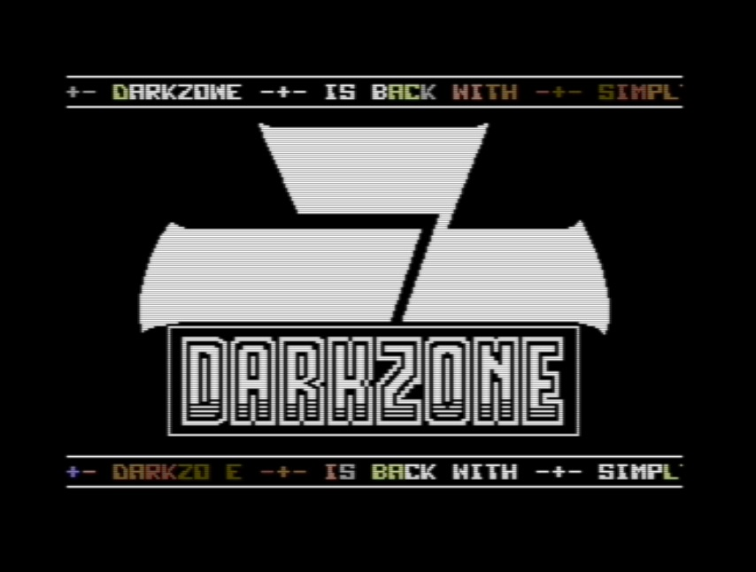

# Simpltro — DarkZone / Syntax 2020

C64 intro released by [DarkZone](https://darkzone.no/) at [Syntax 2020](https://www.syntaxparty.org/) in Melbourne, Australia.



- **Release on CSDB:** https://csdb.dk/release/?id=197960
- **Run in browser:** https://jorgen.skogstad.com/8-16bit/simpltro/
- **Download PRG:** [`release/dz_simpltro_syntax_2020_compressed.prg`](release/dz_simpltro_syntax_2020_compressed.prg)

## About

A C64 intro written in 6502 assembly featuring a full-screen Koala bitmap display, raster interrupt effects, sprite font, and a SID tune. Uses inline Exomizer crunching via [kickass-cruncher-plugins](https://github.com/p-a/kickass-cruncher-plugins) to pack the bitmap data at assembly time.

> "using this as the release version even though it is not really ready.. haha.." — Agnostic

Code by Agnostic (TerraCom). Sprites from the Butt Fat 256kb Sprite Font Compo (CSDB #180797). Font: 7up.64c by Koefler.de. Music: PSOMA2 by SidTracker64.

## Repository layout

```
dz_simpltro_2020_v0.2.1.asm    Main entry point — assemble this file
code/                           Source modules (imported by main file)
macros/macros.asm               KickAssembler macro library
bitmaps/                        C64 Koala graphics (.kla) + source PNG
sprite_font/                    Sprite font binary data
font/                           Custom character font
resources/                      SID tune
build.sh                        Build script
```

## Building

Requires [KickAssembler 5.x](https://theweb.dk/KickAssembler/), [kickass-cruncher-plugins 2.0](https://github.com/p-a/kickass-cruncher-plugins), and **Java 11+** (the cruncher plugin requires Java 11).

```bash
# With both JARs on CLASSPATH:
./build.sh

# Or explicitly:
KICKASS_CP=/path/to/KickAss.jar:/path/to/kickass-cruncher-plugins-2.0.jar ./build.sh
```

Output: `dz_simpltro_2020_v0.2.1.prg` — load into VICE or any C64 emulator.

## Tools used

- [KickAssembler](https://theweb.dk/KickAssembler/) — 6502 assembler
- [kickass-cruncher-plugins](https://github.com/p-a/kickass-cruncher-plugins) — inline Exomizer crunching
- [Exomizer](https://bitbucket.org/magli143/exomizer/wiki/Home) — binary cruncher (for final release `.prg`)
- [Multipaint](http://multipaint.kameli.net/) — C64 graphics
- [VICE](https://vice-emu.sourceforge.io/) — C64 emulator for testing

## Group

[DarkZone](https://darkzone.no/) is a Norwegian demogroup founded in 1992.
